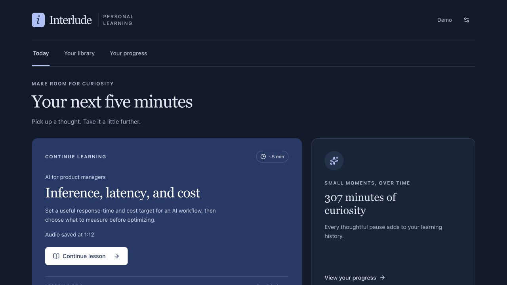
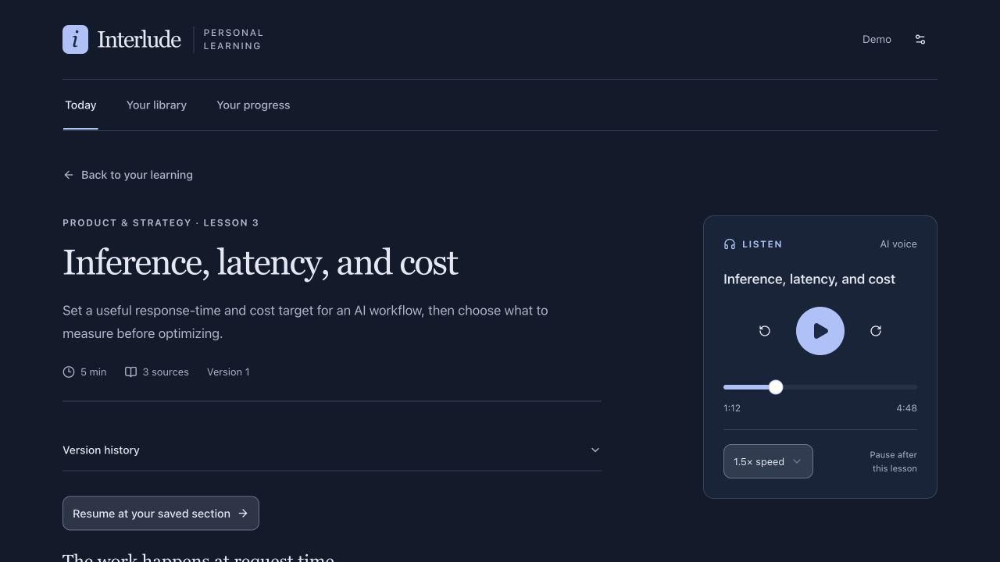
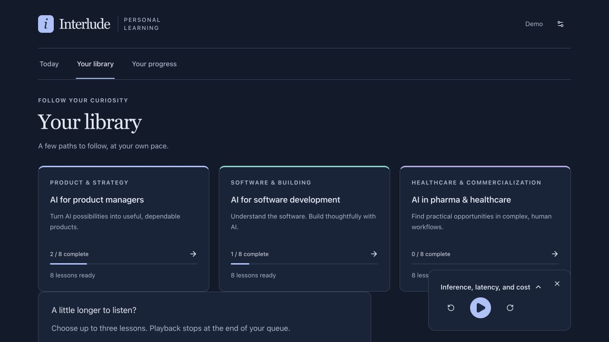
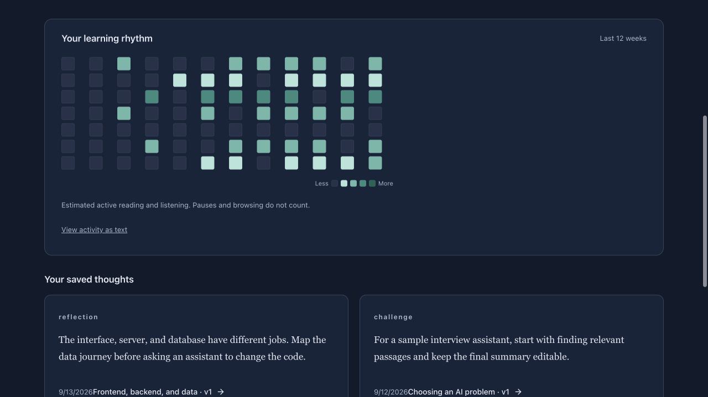

# Interlude

**A personal learning app for the small moments between everything else.**

Interlude turns a spare few minutes into a focused lesson: read or listen, check what you remember, save a thought, and pick up where you left off. It is a full-stack progressive web app designed for an iPhone and a laptop, with one private owner per deployment.

Built by [Kai Takeuchi](https://github.com/ktakeuchi21), with AI-assisted development and editorial work through Codex.

## Why I made this

I kept reaching for my phone in the gaps in my day: waiting for something, taking a break, or getting ready to go somewhere. Those moments often became scrolling. At the same time, there were plenty of things I wanted to understand better—AI product management, software development, healthcare workflows, and eventually topics beyond work.

YouTube and podcasts gave me plenty to consume, but choosing something, switching apps, and remembering where I left off added friction. I wanted one place where I could open the app and immediately continue something worthwhile. For chores or a walk, that meant audio. On my laptop, it meant reading, reviewing a course, and saving an idea I could use.

Interlude is my attempt to make that choice easier. The aim is a regular learning habit and useful understanding, with natural stopping points. Finishing playback is recorded separately from remembering or applying an idea. There is no infinite feed or streak penalty.

## A look inside

Real screenshots of the app running locally, captured September 15, 2026. The **Demo** profile, progress, calendar, and notes are synthetic examples, not my personal learning history. The player uses a silent local audio fixture to show its controls; these images do not demonstrate voice quality. Click an image to view it at full size.

| Pick up your current lesson | Read or listen at your own pace |
| --- | --- |
| [](docs/screenshots/today.jpg) | [](docs/screenshots/lesson-player.jpg) |

| Follow a few learning paths | See your learning rhythm |
| --- | --- |
| [](docs/screenshots/library.jpg) | [](docs/screenshots/progress.jpg) |

## What it does

- **Start quickly:** Today surfaces an in-progress lesson or the next lesson in an active course.
- **Read or listen:** Original cited lessons, saved narration, adjustable speed starting at **1.5×**, seeking, and a persistent player. Tapping the footer player opens its lesson.
- **Keep sessions bounded:** Approximately five-minute lessons at normal speed and a deliberately selected queue of up to three lessons.
- **Practice optionally:** Recall questions, reflections, practical challenges, follow-up questions, and short spoken input with an editable transcript.
- **Follow your curiosity:** Search, pause and reorder courses, save topics and sources, and prepare standalone lessons from reviewed evidence.
- **See progress:** Durable cross-device positions, a contribution-style activity calendar, and separate completion, recall, and application records.
- **Keep evidence and history:** Dated citations, retained source provenance, immutable lesson versions, and exportable learning data.
- **Control costs:** Reserve usage before provider calls, reuse saved audio, retain uncertain attempts, and enforce application spending and storage limits.

### Starter library

| Course | Focus | Lessons |
| --- | --- | ---: |
| AI for product managers | Problem selection, inference, retrieval, uncertainty, evaluation, adoption, and a product brief | 8 |
| AI for software development | Client/server/data, APIs, assistant context, code review, tests, deployment, and a feature plan | 8 |
| AI in pharma & healthcare | Workflow mapping, commercial insights, field support, content review, patient access, evidence, and a pilot | 8 |

All **24 lesson texts** and their exercises are included. Generated audio belongs to an individual deployment and is not included in the repository. Healthcare examples are fictional teaching scenarios; they are not patient-specific advice or claims of deployed clinical outcomes.

New lessons follow the [lesson voice guide](docs/LESSON_STYLE.md): teach concepts directly, keep routine publisher attribution in source notes, and name sources aloud only when their identity matters. Existing released texts and recordings are preserved until an explicit revision is published.

## Stack and why

| Layer | Implementation | Why it fits this project |
| --- | --- | --- |
| Interface | TypeScript, React 19, Next.js App Router conventions | Shared types and reusable components across phone and laptop |
| Build/runtime adapter | Vite 8 + **vinext**, Cloudflare Vite plugin | Runs the Next-style application on a Workers-compatible runtime; retains the existing Sites integration |
| UI | Tailwind CSS 4, Radix/shadcn-style components, Lucide | Consistent responsive controls without building every primitive from scratch |
| Server | Cloudflare Workers through Sites | A small HTTP application with managed deployment; no separate always-on application server |
| Data | D1 SQLite, Drizzle schema and SQL migrations | Durable relational state with atomic updates and an inspectable schema |
| Audio and source artifacts | Private R2 object storage | Large files stay out of the relational database; audio is served through authorized routes |
| Narration | Google Cloud Text-to-Speech, Chirp 3 HD | Saved natural-sounding narration with separate conservative character accounting |
| Optional interactive AI | OpenAI Responses API and transcription | Bounded questions, research, lesson preparation, and short voice drafts |
| Content maintenance | Codex task + trusted publication artifacts | Lets the personal deployment use plan-based research and authoring, while keeping optional runtime API work separate |
| Checks | TypeScript, ESLint, Node test runner, SQLite fixtures, workerd | Tests state changes, evidence checks, recovery, and the actual Worker audio adapter |

This is a **Next-style app built with vinext**, not a standard `next build` deployment. Production authentication depends on the trusted Sites dispatcher. Another host needs a real authentication integration before it can safely run this application.

Read [Architecture and decisions](docs/ARCHITECTURE.md) for the tradeoffs, boundaries, and alternatives considered.

## Experiments and lessons learned

This grew through small implementation trials and feedback from personal use. These were **development experiments, not controlled user studies**. The most useful lessons came from trying the complete workflow, including what happens when something fails.

| What we explored | What happened and what we learned |
| --- | --- |
| **A two-lesson pilot before a full library** | Started with two lessons to exercise sign-in, saved positions, audio, and phone use. Expanded to eight, then 24 lesson texts after playback checks and owner feedback. Prove the learning loop before scaling the catalog. |
| **A home screen that answers “what next?”** | Personal use exposed the friction of finding the current lesson. Today now chooses a saved unfinished lesson or the next available lesson. A separate spacing fix gave the home cards consistent gaps. The entry point deserves as much attention as the library. |
| **Faster audio and an expandable footer player** | Changed the default to 1.5× and made the footer open the correct lesson while preserving the media element and queue. The owner confirmed both refinements worked. A small interaction can matter every session. |
| **OpenAI narration, then Google Chirp 3 HD** | The first course used saved OpenAI narration. We played Charon and Kore samples, tried a full Charon lesson, and selected Charon for new narration. Existing files remain playable. Voice choice and cost accounting are separate decisions; saved replays avoid new synthesis. |
| **Testing in the actual Worker runtime** | Mocked provider tests missed a `fetch` redirect-mode incompatibility that failed during Google authorization. Reproducing it in workerd led to a fix and a runtime-specific test. Passing unit tests did not establish platform compatibility. |
| **Recovery after an interrupted narration** | A live interruption exposed an unreadable error and a missing lesson-level recovery action. Both were fixed, but replacing a genuinely missing Chirp segment is still unfinished. A lost response does not prove the provider did no work, so an automatic retry can be the wrong recovery. |
| **Plan-based authoring alongside API features** | The personal weekly workflow uses a Codex task and reviewed publication artifacts; optional in-app AI uses API credentials. This reduces the need for runtime generation but depends on an awake laptop. A refresh button alone was not an unattended schedule. |
| **Learning measures beyond completion** | Completion, recall, application notes, and active time have separate records. A contribution-style calendar replaced the idea of streak pressure. These are useful signals to inspect, not proof of improved retention or less scrolling. |

The recurring lessons: make the next action obvious, preserve the user's place, keep provider work durable, and make evidence and uncertainty visible. Long-term learning outcomes and total monthly costs still need measurement.

The [build retrospective](docs/EXPERIMENTS.md) records the trials, observed results, decisions, and remaining questions—including lesson versioning, embedded media, and preparing a reproducible public repository.

## Try it locally

Requirements: **Node.js 24** and npm. The versioned lockfile is included.

```sh
git clone https://github.com/ktakeuchi21/interlude.git
cd interlude
npm run install:ci
npm run build
npm run db:migrate:local
npm run dev
```

Open the Local URL printed by the dev server, normally `http://localhost:5173`. Local sign-in uses a clearly separated development identity; it does not sign into the private production account. Reading, progress, and exercises can be explored without provider credentials. Narration and optional AI actions require your own server-side configuration.

See [Setup and deployment](docs/SETUP.md) for migration behavior, Google project configuration, optional secrets, and production authentication requirements.

## Costs and content refresh

The personal design target is **less than $10 per month**. That is a target, not a guaranteed bill.

The implementation caps OpenAI API commitments at **$8 per UTC month**, Chirp at **900,000 conservative UTF-8 bytes over a rolling 32-day window**, and audio storage reservations at **2 GB**. These are application controls, not account-wide provider billing limits. Replaying an existing audio file does not synthesize it again. Hosting, storage, other account usage, taxes, and provider pricing still matter.

Original course authoring and the personal weekly refresh can run through a Codex task using the owner's plan. The configured personal workflow runs Mondays at 8 AM Mountain and requires an awake laptop with Codex running. **Cloning this repository does not install that automation.** The public publication list starts empty, and the scheduling setup is documented in [Weekly refresh](docs/WEEKLY_PLAN_REFRESH.md).

In-app AI questions, research, lesson generation, and transcription use configured **API** credentials and accounting. They do not automatically consume ChatGPT subscription credits. See [Operations and cost controls](docs/OPERATIONS.md).

## Status and limits

This is a working personal project under active development, published as a source reference rather than a multi-user service.

- The three foundation courses and core learning loop are implemented.
- Phone playback and cross-device use have been exercised in the personal deployment. Device behavior still needs checking on each target iOS/browser combination.
- Live generated audio is not bundled; a new deployment starts without it.
- Interrupted Chirp work can remain held if a provider result is missing. Saved-only recovery is available; automatic retries and a complete Chirp replacement workflow are intentionally absent.
- More live quality evaluation is needed for researched answers, generated lessons, transcription, and long-term cost assumptions.
- Offline downloads, Audible account integration, and multi-user accounts are outside the current implementation.

[Roadmap](docs/ROADMAP.md) · [Verification](docs/VERIFICATION.md) · [iPhone playback checklist](docs/IPHONE_TEST.md)

## Development

```sh
npm run typecheck
npm run lint
npm test
npm run test:worker
npm run check:public
npm run build
```

The core suite currently contains **127 tests**. Its providers and keys are synthetic; it does not send paid requests. GitHub Actions runs the checks and build without production secrets. See [Contributing](CONTRIBUTING.md) before changing state, accounting, or authentication.

## Repository map

```text
app/                 App Router pages, private API routes, authentication adapter
components/          Reader, player, library, exercises, settings, UI primitives
lib/                 Lessons, evidence, progress, provider and accounting logic
db/ + drizzle/       Schema and ordered migrations
public/              PWA manifest, icons, online-only service worker
scripts/             Local setup, tests, publication preparation, public-source check
tests/               Core fixtures and loopback-only HTTP tests
docs/                Product, architecture, experiments, screenshots, setup, operations
```

This repository starts from a sanitized source snapshot. Production identifiers, owner-specific weekly publications, private operational logs, databases, credentials, and saved media are excluded. Public source does not grant access to the personal app.

## Attribution and reuse

Third-party notices are retained in [THIRD_PARTY_NOTICES.md](THIRD_PARTY_NOTICES.md). No general reuse license is granted for Interlude's original code or lesson text at this time. The public repository is available to inspect; third-party components retain their own licenses.
