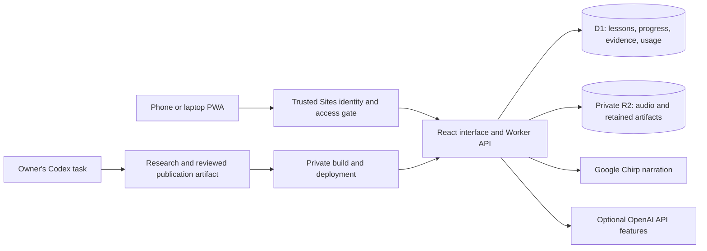

# Architecture and decisions

## System boundaries

The app's authenticated state load imports trusted publications after validating their owner, week, fingerprint, and evidence. The scheduled Codex task prepares and publishes content; it is not a cloud timer embedded in this Worker. A public clone starts with an empty publication list.

## PWA instead of a native app

One responsive application covers everyday phone use and laptop course management. An installable shell and standard media element make that a practical initial scope for one user. The tradeoff is reliance on browser and iOS media behavior. Offline storage and native-platform features are not implemented, and desktop tests do not prove headset or lock-screen behavior.

The service worker deliberately avoids caching private responses. It is an online PWA, not an offline lesson downloader.

## React and TypeScript, with vinext on Vite

React components reuse the same reader, exercises, and player across views. Shared TypeScript types make lesson versions, progress and API state explicit. Tailwind and the existing Radix/shadcn-style primitives support consistent controls.

The repository uses Next.js routing conventions through **vinext** and Vite. This retains the Sites starter's Workers integration; it is not a claim that every Next.js feature works unchanged. vinext is an early runtime adapter, so compatibility and upgrade testing remain a maintenance cost. The package lock records exact dependencies. No dependency migration was undertaken merely to make the repository public.

## Workers, D1 and R2 instead of a separate server and database service

The workload is HTTP requests, a small relational dataset, and saved audio. Workers fit that shape without operating a separate application server. D1 holds relational records, immutable versions, and transactional reservations. Drizzle declares the schema and produces SQL migrations; much runtime SQL is deliberately explicit for atomic guard conditions.

Audio and recovery segments belong in R2 rather than database blobs. Authorized HTTP routes serve media with byte ranges and HEAD support. Streaming WAV assembly avoids holding a second full audio copy in memory.

The tradeoffs are platform coupling, Worker memory/execution constraints, and the need to make slow external calls interruption-safe. The current host does not expose a general background worker queue through this application. Cloud hosting allowances are not a guarantee of a zero invoice.

## Single-owner authorization

Production identity comes from the trusted Sites dispatcher. The app then pins one owner in D1 and checks that identity for APIs and private media. Same-origin write checks provide an additional boundary; they are not a replacement for authentication.

**The `oai-authenticated-*` headers are trusted infrastructure inputs.** Exposing the Worker directly on a host that accepts those headers from arbitrary clients is unsafe. Another hosting environment must supply a verified authentication adapter, strip untrusted identity headers, and restrict initial owner enrollment. The loopback-only development sign-in fixture is not production authentication.

## Saved narration instead of live speech generation on every play

Generate once for a lesson version, store the result, and let the browser handle playback rate, position, seeking, and Media Session controls. Replays avoid another synthesis request. Keeping the same audio element through queue changes also supports continuity of media authorization and system controls.

New narration uses Chirp 3 HD, with a pinned voice per job and validated 24 kHz mono PCM audio. The older OpenAI audio path is retained for existing files and saved-segment recovery; production entry points do not silently fall back to new OpenAI narration.

This approach spends storage to reduce repeated generation. A slow or lost synthesis response still requires conservative accounting. Missing-result replacement for Chirp is an acknowledged unfinished workflow.

## Two ways to prepare content

The personal scheduled workflow uses an existing Codex task to research, author, review and privately publish a bounded artifact. This fits a personal project whose owner already uses that plan. It requires the laptop and authorized tools to be available.

Optional in-app questions, research, drafting and transcription use server-configured OpenAI API credentials. They are separate runtime operations with their own ledger. The repository does not convert subscription credits into API balance.

A source-backed lesson has explicit inputs, an evidence review, a draft, a teaching review, and a guarded release. These checks improve traceability; they do not make model-generated content automatically correct.

## State and evidence over mutable blobs

Lesson identity includes a version. Releases preserve old versions and reference the exact checked content and sources. Notes, recall records and playback positions continue to refer to the version used. Completing an older version retains course completion credit.

Reading and listening positions carry observation times and revisions to reduce stale-device overwrites. Activity uses bounded time intervals rather than treating an open tab as continuous learning. Weekly sets have stable identities and separate owner choices.

## Reserve before requesting, recover before retrying

SQL reservations precede provider calls. Stable operation identifiers prevent repeat submissions from becoming repeated spending. A fenced generation claim serializes work and prevents an expired worker from committing as a newer job.

Ambiguous results keep their allowance. Recovery checks stored output before any new request. An expired lock can be released without erasing the original usage. This may pause generation conservatively when the provider did work but its response was lost; preserving that distinction is more important than presenting a misleading successful retry.

See [Operations](OPERATIONS.md) and the corresponding tests for the implemented rules and remaining gaps.
